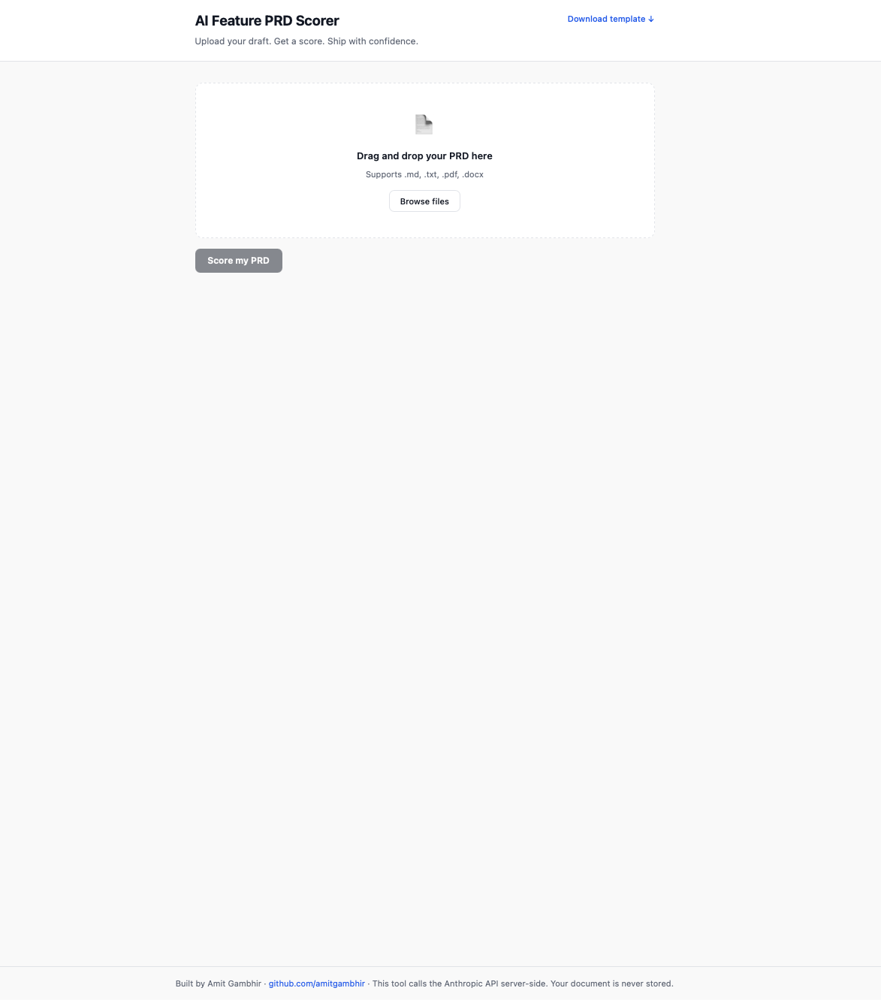
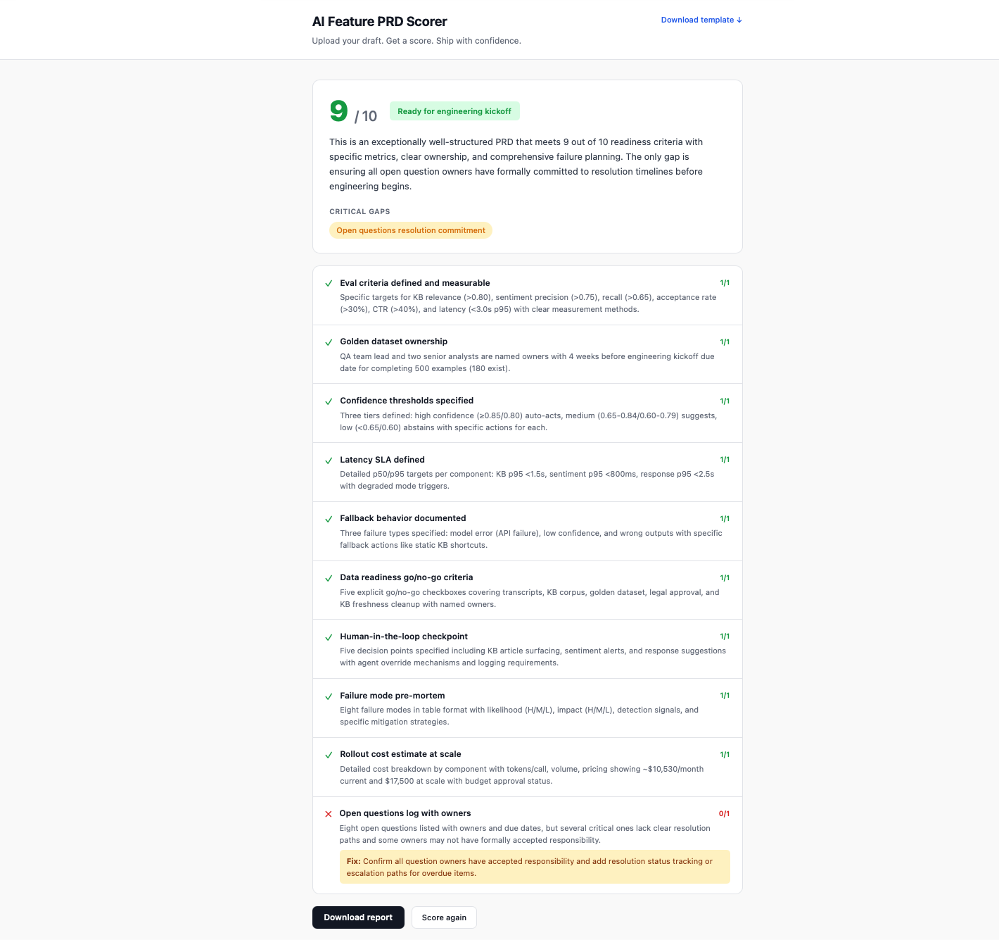
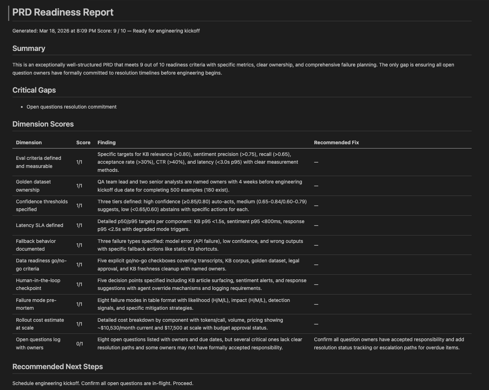

# 📋 AI Feature PRD Toolkit

**Most AI features fail not because the model is bad, but because the requirements were written for the wrong kind of system.**

[](LICENSE)
[](https://nextjs.org)
[](https://anthropic.com)

---

## Table of Contents

1. [The Problem](#the-problem)
2. [What's in this repo](#whats-in-this-repo)
3. [How to use](#how-to-use)
4. [PRD Scorer Web App](#prd-scorer-web-app)
5. [Built On](#built-on)
6. [Architecture](#architecture)
7. [Screenshots](#screenshots)
8. [Run locally](#run-locally)
9. [Run tests](#run-tests)
10. [Deploy your own](#deploy-your-own)
11. [Why this is different from a standard PRD](#why-this-is-different-from-a-standard-prd)

---

## The Problem

A standard PRD tells you what a feature should do. That's fine when the system is deterministic. When the system is a language model, "what it should do" is the easy part. The hard parts are:

- What does a *good* output look like, in measurable terms, before you build?
- What happens when the model is slow, wrong, or uncertain?
- What data must exist before you start, and who's responsible for it?
- What are the failure modes, and who owns the mitigations?

Most teams answer these questions in production, not in requirements. This repo is a framework for answering them before engineering starts.

---

## What's in this repo

| Artifact | Description |
| --- | --- |
| [`template/AI-FEATURE-PRD-TEMPLATE.md`](template/AI-FEATURE-PRD-TEMPLATE.md) | The 10-section PRD template with inline guidance for each field |
| [`scorecard/PRD-READINESS-SCORECARD.md`](scorecard/PRD-READINESS-SCORECARD.md) | A 10-point checklist to score any AI PRD before engineering kickoff |
| [`example/real-time-agent-assist-prd.md`](example/real-time-agent-assist-prd.md) | A fully worked example: real-time AI assist for a contact center |
| [`assets/prd-vs-ai-prd-comparison.md`](assets/prd-vs-ai-prd-comparison.md) | Side-by-side: traditional PRD sections vs. their AI-native equivalents |
| [`scorer/`](scorer/) | Next.js web app — upload a PRD, get an AI-generated score and downloadable report |

---

## How to use

1. **Start with the template.** Copy [`AI-FEATURE-PRD-TEMPLATE.md`](template/AI-FEATURE-PRD-TEMPLATE.md) and fill it in for your feature. Don't skip sections — the gaps are the signal.
2. **Score your draft.** Upload it to the [PRD Scorer](#prd-scorer-web-app) or run it through the [`PRD-READINESS-SCORECARD.md`](scorecard/PRD-READINESS-SCORECARD.md) manually. If you score below 7, you have known gaps before engineering starts.
3. **See the worked example.** [`real-time-agent-assist-prd.md`](example/real-time-agent-assist-prd.md) shows every section filled in for a real-world AI feature. Use it to calibrate what "specific enough" looks like.

---

## PRD Scorer Web App

**Live:** [https://ai-feature-prd-toolkit.vercel.app/](https://ai-feature-prd-toolkit.vercel.app/)

Upload any AI feature PRD — `.md`, `.txt`, `.pdf`, or `.docx` — and get an instant 10-point readiness score powered by Claude. Each dimension returns a finding, a fix recommendation, and a downloadable Markdown report. The app also offers a direct download of the PRD template so you can start from scratch without leaving the page.

```text
Input: Your AI feature PRD (any format)

──────────────────────────────────────────────
  PRD Readiness Score    7 / 10
  Address gaps before sprint planning
──────────────────────────────────────────────
  Critical gaps:
  · No golden dataset owner or due date
  · Cost estimate missing
  · Confidence thresholds not specified

  ✓  Eval criteria defined and measurable       1/1
  ✗  Golden dataset ownership                   0/1
       Finding: PRD mentions eval but no owner or dataset exists.
       Fix: Name the person creating the dataset and set a due date
            before engineering kickoff.
  ✓  Confidence thresholds specified            1/1
  ✓  Latency SLA defined                        1/1
  ✓  Fallback behavior documented               1/1
  ✓  Data readiness go/no-go criteria           1/1
  ✓  Human-in-the-loop checkpoint               1/1
  ✓  Failure mode pre-mortem                    1/1
  ✗  Rollout cost estimate at scale             0/1
       Finding: No token/volume/cost calculation present.
       Fix: Estimate tokens × daily volume × price for each model call.
  ✓  Open questions log with owners             1/1
──────────────────────────────────────────────
  [ Download report ]   [ Score again ]
──────────────────────────────────────────────
```

The Anthropic API call happens server-side. Your document is never stored.

---

## Built On

| Tool | Why |
| --- | --- |
| Next.js 14 | Single repo for frontend and serverless API routes — no separate backend to deploy |
| React | UI only, no component library — the scorer page is a single file with inline styles |
| Claude (claude-sonnet-4-20250514) | Structured JSON output via the Messages API; strong instruction-following for strict per-dimension scoring |
| pdf.js | Client-side PDF parsing without bundling — injected dynamically only when a `.pdf` is uploaded |
| mammoth.js | Client-side `.docx` → plain text; same on-demand injection pattern as pdf.js |
| Vercel | Zero-config deployment; root directory set to `scorer/` so only the app is deployed, not the markdown artifacts |

---

## Architecture

```text
┌─────────────────────────────────────────────┐
│  Browser                                     │
│  pages/index.js                              │
│                                              │
│  File upload (.md / .txt / .pdf / .docx)     │
│  Client-side parsing (FileReader, pdf.js,    │
│  mammoth.js — loaded on demand)              │
│  Results UI + report download                │
└──────────────────┬──────────────────────────┘
                   │  POST /api/score
                   │  { prdText: string }
┌──────────────────▼──────────────────────────┐
│  Next.js API Route                           │
│  pages/api/score.js                          │
│                                              │
│  · Validates input (100–50,000 chars)        │
│  · Calls Anthropic API with scoring prompt   │
│  · Strips code fences, parses JSON response  │
│  · Returns structured score object           │
│                                              │
│  ANTHROPIC_API_KEY — server-side only,       │
│  never exposed to the browser                │
└──────────────────┬──────────────────────────┘
                   │
┌──────────────────▼──────────────────────────┐
│  Anthropic API                               │
│  claude-sonnet-4-20250514                    │
│                                              │
│  Evaluates PRD against 10 dimensions         │
│  Returns structured JSON: scores, findings,  │
│  fixes, top gaps, summary, verdict           │
└─────────────────────────────────────────────┘
```

---

## Screenshots







---

## Run locally

```bash
npm run install:scorer                           # install dependencies (first time)
cp scorer/.env.local.example scorer/.env.local   # add your ANTHROPIC_API_KEY
npm run dev                                      # copies template → public/, starts http://localhost:3000
```

## Run tests

```bash
npm run install:scorer   # if not already installed
cd scorer && npm test    # 38 tests — API route + pure functions
```

The test suite covers input validation, boundary conditions, and security properties: non-string inputs rejected, API key never present in responses, raw Anthropic envelope never forwarded, and malformed upstream JSON handled without leaking content.

---

## Deploy your own

1. Fork this repo
2. Go to [vercel.com](https://vercel.com) → Import project → select this repo → **set the root directory to `scorer`**
3. Add `ANTHROPIC_API_KEY` as an environment variable in the Vercel project settings
4. Deploy — Vercel handles the rest

---

## Why this is different from a standard PRD

- **AI systems don't pass or fail — they degrade.** Standard acceptance criteria assume binary correctness. This template forces you to define confidence tiers, fallback behavior, and what happens when the model is slow, wrong, or uncertain.
- **The data is a dependency, not a detail.** Most AI features stall in production because the data was assumed, not specified. The data readiness gates section treats data quality as a go/no-go criterion — because it is.
- **Evaluation criteria have to be designed before the model is built.** If you wait until the model is done to decide how to measure it, you'll end up measuring what's easy, not what matters. This template starts with eval criteria.

---

*If you can't define what "good" looks like before you build, you'll know it when it's too late.*
